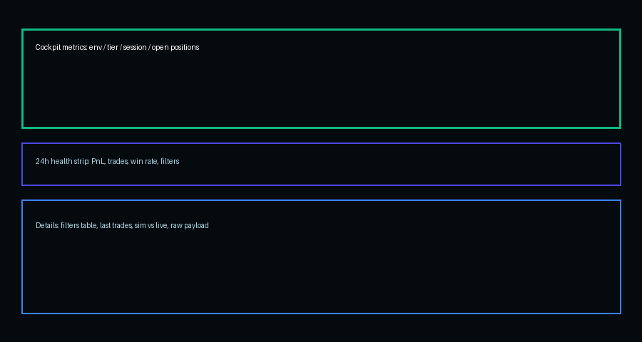

# Monitoring Workflow

This repo now ships with a lightweight monitoring loop so OmegaFX behaves like a tiny fund desk. Each cycle collects fresh executions, produces reporting snapshots, and then distills them into a notification-ready summary.

## How the pieces fit

- `scripts/run_demo_autopilot.py` - drives the MT5 execution backend for a configurable duration. Pass `--risk_tier <name>` (conservative/normal/aggressive) to pull the right limits from `config/risk_profiles.yaml` instead of supplying raw fractions. Use `--risk_env demo|live` (default `demo`); when `live`, the script enforces the hard caps defined under the `live` section of the config and refuses to run unless `--confirm_live` is supplied. Each run emits a unique `session_id` (env + tier + timestamp) that threads through logs, reports, and notifications. The autopilot produces the raw `results/mt5_<tag>_exec_log.csv` and the live summary JSON.
- `scripts/run_exec_quarterly_report.py` - wrapper that generates a Markdown report for any window (commonly 6h) using the shared generator in `run_daily_exec_report.py`. Accepts `--session-id` to constrain stats to a single run.
- `scripts/run_daily_exec_report.py` - same generator as above, but exposed as a CLI for arbitrary windows (commonly 24h). The reports land in `results/exec_report_<tag>_<hours>h_<timestamp>.md`, note the risk tier + env, and also allow `--session-id` filters.
- `scripts/build_notification_snapshot.py` - parses the latest 6h/24h reports (optionally filtered via `--session-id`), prints a single-line summary (showing env/tier), and stores it in `results/notification_snapshot_<tag>.txt` so it can be piped into email, chat, etc.

## Example cycle

```
# 1) Run autopilot for 30 minutes
python scripts/run_demo_autopilot.py ^
  --hours 0.5 ^
  --sleep-seconds 10 ^
  --risk_tier conservative ^
  --risk_env demo

# 2) Generate 6h + 24h reports
python scripts/run_exec_quarterly_report.py --hours 6 --tag demo
python scripts/run_daily_exec_report.py --hours 24 --tag demo

# 3) Build notification snapshot
python scripts/build_notification_snapshot.py --tag demo
```

The autopilot prints the generated `session_id`. Pass it to any downstream command via `--session-id <value>` if you want the 6h/24h reports and notification snapshot to focus solely on that run.

## Windows automation helpers

Batch scripts under `scripts\windows\` make scheduling easy:

- `run_autopilot_demo.bat`
- `run_reports_demo.bat`
- `send_notification_demo.bat`

Example registrations via `schtasks` (run from an elevated PowerShell or cmd prompt):

```
:: Kick off the demo autopilot every 4 hours
schtasks /Create /SC HOURLY /MO 4 /TN "OmegaFX_Autopilot" ^
  /TR "\"C:\Users\Administrator\Omega-FX\scripts\windows\run_autopilot_demo.bat\"" ^
  /RL HIGHEST

:: Generate reports + notification snapshot every 6 hours
schtasks /Create /SC HOURLY /MO 6 /TN "OmegaFX_Reports" ^
  /TR "\"C:\Users\Administrator\Omega-FX\scripts\windows\run_reports_demo.bat\"" ^
  /RL HIGHEST
```

Those commands create scheduled tasks that call the batch files, which in turn activate the virtual environment, run the autopilot, generate reports, and build the notification snapshot automatically.

### Importing XML templates

Prefer the Task Scheduler GUI" Import the XML templates under `windows\`:

1. `task_autopilot_demo.xml` - runs the 23.5h conservative autopilot loop daily at 00:05.
2. `task_reports_demo.xml` - reruns the reporting batch every 6 hours to refresh both Markdown reports and the snapshot.
3. `task_healthcheck_weekly.xml` - executes `scripts/run_omega_healthcheck.py` every Sunday at 18:00 (server time).

In Task Scheduler choose **Action > Import Task...**, select the XML, confirm the user, and save.

## Notifications

Create a Telegram bot (via [@BotFather](https://t.me/BotFather)), grab the token, invite the bot to the chat you want to monitor, and copy the chat_id (many people use [@myidbot](https://t.me/myidbot) to query it). Drop those values into `config/notifications.yaml`, then run:

```
python scripts/send_notification_snapshot.py --tag demo
```

That command reads `results/notification_snapshot_demo.txt`, sends the env/tier snapshot via Telegram, and prints the delivery status. You can also schedule the helper batch file `scripts\windows\send_notification_demo.bat`.

## Weekly Healthcheck

Run the full system check (or schedule it for Sunday) with:

```
python scripts/run_omega_healthcheck.py
```

The healthcheck runs the execution backend tests, MT5 smoketest, a short dry-run autopilot burst using the conservative tier, regenerates the 6h/24h reports, and rebuilds the notification snapshot. If everything passes you'll see a PASS line listing the refreshed report paths and snapshot file; otherwise it reports the failing step so you can investigate.

> **Live safety rails:** Running with `--risk_env live` forces the loader to clamp tier values to the live maxima defined in `config/risk_profiles.yaml` and requires `--confirm_live` to avoid accidental use on real capital. Keep that flag out of scheduled demo tasks unless you're intentionally migrating to production.

## Local Dashboard

Run the local API and dashboard when you want an on-demand view from the VPS (accessible via RDP browser hitting 127.0.0.1):

```
# Terminal 1 – API backend
type .\.venv\Scripts\activate
python scripts\run_local_api.py

# Terminal 2 – Streamlit dashboard
streamlit run scripts\run_local_dashboard.py
# (or python scripts\run_local_dashboard.py which bootstraps Streamlit automatically)
```

Open http://127.0.0.1:8501/ in the VPS browser. The dashboard surface includes:
- Status panel (env/tier/session, equity, trailing 24h PnL + filter counts)
- Trades table with hours/session filters pulling from mt5_demo_exec_log.csv
- Report/simulation comparison panel that summarizes the latest session and contrasts live win rate + avg PnL per trade with the stored backtest summary.



**Cockpit metrics.** The top row surfaces the live context: environment, risk tier, current `session_id`, and the exact MT5 open-position count/PnL pulled directly from the terminal (so you instantly know if anything is still running). The next row shows start/end equity plus session-level equity and balance PnL with green/red borders; if the balance delta doesn't match the sum of CLOSE events in `mt5_demo_exec_log.csv` (~$1) a reconciliation badge appears so you know to double-check the MT5 history tab.

**24h health strip.** A compact strip summarizes the last 24h realized PnL (with percentage), closed trade count, win rate, and a single line with the three filter counters (`max_positions / daily_loss / invalid_stops`). It's designed to be read like a status light: at a glance you know whether the day was calm or "spicy."

**Details pane.** Expand the "Details" section for the filter table, "Last N trades" (default 10, adjustable), Sim vs Live comparison, and a raw JSON payload for debugging. This mirrors the underlying Markdown/JSON artifacts so the dashboard stays purely read-only.

> OmegaFX numbers are strategy-scoped (only trades with our MT5 comment/tag). The MT5 account view includes everything (manual clicks or other EAs). Session PnL reflects one autopilot run (start vs end equity/balance), 24h PnL is the rolling realized value over the last day, and MT5's balance/equity continues to include anything else you might do outside this automation. Use the reconciliation badge to spot mismatches quickly.
